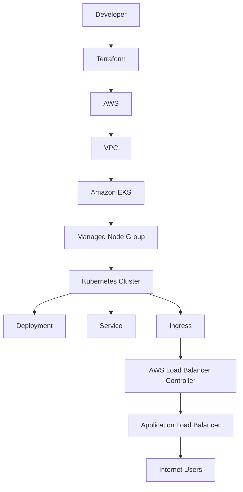

# AWS EKS Two-Tier Application Deployment using Terraform

Deploy a production-ready Amazon Elastic Kubernetes Service (EKS) cluster using Terraform and host a two-tier application on Kubernetes with AWS Application Load Balancer (ALB) Ingress.

This project demonstrates Infrastructure as Code (IaC), Kubernetes orchestration, AWS networking, IAM integration, and production deployment practices commonly used by Platform Engineering and DevOps teams.

---

## Project Overview

This project provisions a complete Kubernetes platform on Amazon EKS using Terraform. The infrastructure is deployed entirely through Infrastructure as Code (IaC), enabling consistent, repeatable, and version-controlled deployments without manual configuration.

After provisioning the infrastructure, a sample two-tier application is deployed to the EKS cluster using Kubernetes manifests. The application is exposed externally through the AWS Load Balancer Controller, which automatically provisions an AWS Application Load Balancer (ALB) based on the Kubernetes Ingress resource.

The project demonstrates the end-to-end workflow of provisioning cloud infrastructure, configuring Kubernetes, deploying applications, and exposing services securely using AWS-native integrations.

### Key Objectives

- Provision AWS infrastructure using Terraform
- Deploy and manage an Amazon EKS cluster
- Configure AWS networking components
- Implement IAM Roles for Service Accounts (IRSA)
- Deploy a containerized application on Kubernetes
- Expose the application using AWS ALB Ingress
- Store Terraform state remotely using Amazon S3 and DynamoDB
- Follow infrastructure organization aligned with production environments

> **Note:** This project focuses on infrastructure provisioning and Kubernetes deployment. The application used is intentionally simple to emphasize the platform engineering aspects of the solution.

# Solution Architecture

The following diagram illustrates the high-level architecture of the solution, showing how Terraform provisions the AWS infrastructure and how Kubernetes resources interact to expose the application through an AWS Application Load Balancer.



### Architecture Workflow

The deployment follows the sequence below:

1. Terraform provisions the AWS infrastructure, including the VPC, networking components, IAM resources, and the Amazon EKS cluster.
2. Managed worker nodes join the EKS cluster and become available for scheduling workloads.
3. Kubernetes manifests deploy the application as a Deployment and expose it internally using a Service.
4. An Ingress resource is created to expose the application externally.
5. The AWS Load Balancer Controller detects the Ingress resource and automatically provisions an Application Load Balancer (ALB).
6. External users access the application through the ALB, which routes traffic to the Kubernetes Service and ultimately to the application Pods.

### Architecture Components

| Component | Purpose |
|-----------|---------|
| Terraform | Provisions AWS infrastructure using Infrastructure as Code (IaC). |
| Amazon VPC | Provides network isolation for the EKS cluster. |
| Public Subnets | Separate internet-facing resources from worker nodes. |
| Internet Gateway | Enables internet connectivity for public resources. |
| Amazon EKS | Managed Kubernetes control plane. |
| Managed Node Group | Provides EC2 worker nodes to run Kubernetes workloads. |
| IAM Roles & OIDC | Enables secure authentication between Kubernetes service accounts and AWS services using IRSA. |
| Kubernetes Deployment | Manages application Pods and desired state. |
| Kubernetes Service | Exposes Pods internally within the cluster. |
| Kubernetes Ingress | Defines external routing rules for the application. |
| AWS Load Balancer Controller | Automatically provisions an ALB based on Kubernetes Ingress resources. |
| Application Load Balancer | Routes external HTTP/HTTPS traffic to the application running inside Kubernetes. |

## Technology Stack

The project leverages the following technologies to provision infrastructure, deploy applications, and manage Kubernetes resources.

| Category | Technology | Purpose |
|----------|------------|---------|
| Infrastructure as Code | Terraform | Provisions and manages AWS infrastructure in a declarative manner. |
| Cloud Platform | Amazon Web Services (AWS) | Provides the cloud infrastructure required to host the Kubernetes platform. |
| Container Orchestration | Amazon EKS | Managed Kubernetes service used to deploy and manage containerized workloads. |
| Container Runtime | Docker | Packages the application into portable container images. |
| Cluster Management | Kubernetes | Orchestrates application deployment, scaling, networking, and lifecycle management. |
| Networking | Amazon VPC | Provides network isolation and connectivity for the EKS cluster. |
| Load Balancing | AWS Application Load Balancer (ALB) | Exposes the application securely to external users. |
| Ingress Controller | AWS Load Balancer Controller | Automatically provisions and manages ALBs from Kubernetes Ingress resources. |
| Authentication | IAM & IRSA | Enables secure access between Kubernetes workloads and AWS services without static credentials. |
| State Management | Amazon S3 | Stores the remote Terraform state file. |
| State Locking | Amazon DynamoDB | Prevents concurrent Terraform operations by providing state locking. |
| Command Line Tools | AWS CLI, kubectl | Used to provision, configure, and manage AWS resources and Kubernetes clusters. |

### Why These Technologies?

This project uses a combination of industry-standard DevOps tools to demonstrate modern cloud infrastructure provisioning and Kubernetes platform management.

- **Terraform** enables repeatable and version-controlled infrastructure deployments.
- **Amazon EKS** eliminates the operational overhead of managing the Kubernetes control plane.
- **Docker** ensures applications are packaged consistently across environments.
- **AWS Load Balancer Controller** provides native integration between Kubernetes Ingress resources and AWS Application Load Balancers.
- **Amazon S3** and **DynamoDB** provide secure remote state storage and locking for collaborative Terraform workflows.
- **IAM Roles for Service Accounts (IRSA)** follows AWS security best practices by eliminating the need to store long-lived AWS credentials inside containers.

  ## AWS Services Used

The following AWS services are provisioned and configured as part of this project.

| AWS Service | Purpose |
|-------------|---------|
| Amazon VPC | Provides an isolated virtual network for the Kubernetes cluster. |
| Public Subnets | Host the EKS worker nodes and internet-facing resources. |
| Internet Gateway | Enables internet connectivity for resources within the VPC. |
| Route Tables | Control network traffic routing within the VPC. |
| Security Groups | Act as virtual firewalls to control inbound and outbound traffic. |
| Amazon EKS | Provides the managed Kubernetes control plane. |
| EC2 Managed Node Group | Hosts the Kubernetes worker nodes that run application workloads. |
| IAM | Creates roles and policies required by the EKS cluster, worker nodes, and AWS Load Balancer Controller. |
| IAM OIDC Provider | Enables IAM Roles for Service Accounts (IRSA) for secure AWS service access from Kubernetes workloads. |
| Application Load Balancer (ALB) | Routes external HTTP/HTTPS traffic to the Kubernetes application. |
| Amazon S3 | Stores the remote Terraform state file. |
| Amazon DynamoDB | Provides state locking to prevent concurrent Terraform operations. |

### Infrastructure Provisioning Summary

Terraform provisions all core AWS infrastructure required to host the Kubernetes platform, including networking, identity and access management, and the Amazon EKS cluster.

The AWS Load Balancer Controller is installed within the Kubernetes cluster and dynamically provisions an Application Load Balancer (ALB) whenever a Kubernetes Ingress resource is created.

This separation of responsibilities keeps Terraform focused on infrastructure provisioning while allowing Kubernetes to manage application-specific resources.

### Responsibility Split

| Managed By Terraform | Managed By Kubernetes |
|----------------------|-----------------------|
| VPC | Deployment |
| Public Subnets | Service |
| Internet Gateway | Ingress |
| Route Tables | Pods |
| Security Groups | ReplicaSets |
| IAM Roles | Namespaces |
| OIDC Provider | ConfigMaps |
| Amazon EKS Cluster | Secrets |
| Managed Node Group | Application Load Balancer (via AWS Load Balancer Controller) |
| S3 Backend | |
| DynamoDB Lock Table | |

## Repository Structure

The repository is organized to separate infrastructure components into logical Terraform configuration files. This modular structure improves readability, maintainability, and scalability.

```text
terraform/
├── backend.tf                 # Remote backend configuration (S3 & DynamoDB)
├── provider.tf                # AWS provider configuration
├── versions.tf                # Terraform and provider version constraints
├── variables.tf               # Input variable definitions
├── terraform.tfvars           # Environment-specific variable values
├── vpc.tf                     # VPC, subnets, route tables, and networking
├── eks.tf                     # Amazon EKS cluster and managed node group
├── iam.tf                     # IAM roles and policies
├── oidc.tf                    # IAM OIDC provider configuration
├── alb-irsa.tf                # IAM Role for Service Account (AWS Load Balancer Controller)
├── security-groups.tf         # Security Group definitions
├── locals.tf                  # Local values
├── outputs.tf                 # Terraform outputs
└── policies/                  # Custom IAM policy documents
```

## Deployment Workflow

The deployment process consists of two major phases:

1. **Infrastructure Provisioning** using Terraform.
2. **Application Deployment** using Kubernetes manifests.

The workflow below illustrates the complete deployment lifecycle.

```text
Developer
    │
    ▼
Terraform Init
    │
    ▼
Terraform Plan
    │
    ▼
Terraform Apply
    │
    ▼
AWS Infrastructure Provisioned
(VPC, IAM, EKS, Node Group)
    │
    ▼
Update kubeconfig
    │
    ▼
Deploy Kubernetes Resources
(Deployment, Service, Ingress)
    │
    ▼
AWS Load Balancer Controller
    │
    ▼
Application Load Balancer (ALB)
    │
    ▼
External Users Access Application
```

### Deployment Stages

| Stage | Description |
|--------|-------------|
| Initialize Terraform | Downloads the required providers and configures the remote backend. |
| Plan Infrastructure | Generates an execution plan showing the resources Terraform will create. |
| Apply Infrastructure | Provisions AWS networking, IAM resources, and the Amazon EKS cluster. |
| Configure kubectl | Updates the local kubeconfig to communicate with the EKS cluster. |
| Deploy Application | Creates the Kubernetes Deployment, Service, and Ingress resources. |
| Provision ALB | AWS Load Balancer Controller automatically creates an Application Load Balancer based on the Ingress resource. |
| Validate Deployment | Verify that the application is accessible through the ALB endpoint. |

### Infrastructure vs Application

This project intentionally separates infrastructure provisioning from application deployment.

- **Terraform** provisions long-lived AWS infrastructure such as the VPC, IAM resources, Amazon EKS cluster, and worker nodes.
- **Kubernetes** manages application resources such as Deployments, Services, Ingresses, and Pods.
- **AWS Load Balancer Controller** bridges Kubernetes and AWS by dynamically creating an Application Load Balancer whenever an Ingress resource is deployed.

This separation follows Infrastructure as Code (IaC) best practices and mirrors production deployment workflows.

## Prerequisites

Before deploying the infrastructure, ensure the following prerequisites are met.

| Requirement | Purpose |
|------------|---------|
| AWS Account | Used to provision all cloud resources. |
| IAM User or Role | Must have sufficient permissions to create networking, IAM, and EKS resources. |
| Terraform | Used to provision AWS infrastructure. |
| AWS CLI | Used to authenticate with AWS and configure access to the EKS cluster. |
| kubectl | Used to deploy and manage Kubernetes resources. |
| Git | Used to clone the project repository. |
| Amazon S3 Bucket | Stores the remote Terraform state file. |
| Amazon DynamoDB Table | Provides Terraform state locking. |

### Required Tool Versions

The project was developed and tested using the following tool versions.

| Tool | Version |
|------|---------|
| Terraform | >= 1.x |
| AWS CLI | v2 |
| kubectl | Compatible with the target Kubernetes version |

### AWS Permissions

The IAM user or role executing Terraform should have permissions to create and manage resources including:

- Amazon VPC
- Amazon EKS
- EC2
- IAM
- Elastic Load Balancing (ALB)
- Amazon S3
- Amazon DynamoDB

In production environments, permissions should follow the principle of least privilege.

### Remote Terraform Backend

Terraform uses a remote backend to store the infrastructure state.

- **Amazon S3** stores the Terraform state file.
- **Amazon DynamoDB** provides state locking to prevent concurrent Terraform operations.

Using a remote backend enables collaboration, improves reliability, and prevents state corruption during simultaneous deployments.

## Infrastructure Deployment

Follow the steps below to provision the AWS infrastructure using Terraform.

### Step 1: Clone the Repository

```bash
git clone <repository-url>
cd <repository-name>/terraform
```

---

### Step 2: Configure the Terraform Backend

Ensure the remote backend configuration points to the existing Amazon S3 bucket and DynamoDB table.

Example:

```hcl
terraform {
  backend "s3" {
    bucket         = "<your-s3-bucket>"
    key            = "terraform.tfstate"
    region         = "<aws-region>"
    dynamodb_table = "<your-dynamodb-table>"
    encrypt        = true
  }
}
```

---

### Step 3: Initialize Terraform

Initialize the working directory and download the required providers.

```bash
terraform init
```

---

### Step 4: Review the Execution Plan

Generate an execution plan before provisioning infrastructure.

```bash
terraform plan
```

Review the output carefully to understand which resources Terraform will create or modify.

---

### Step 5: Provision the Infrastructure

Create the AWS infrastructure.

```bash
terraform apply
```

Confirm the execution plan when prompted.

Terraform provisions resources including:

- Amazon VPC
- Public Subnets
- Internet Gateway
- Route Tables
- Security Groups
- IAM Roles
- IAM OIDC Provider
- Amazon EKS Cluster
- Managed Node Group

### Verify the Deployment

Verify that the Amazon EKS cluster has been created successfully.

```bash
aws eks list-clusters
```

Verify the managed node group.

```bash
aws eks describe-nodegroup \
  --cluster-name <cluster-name> \
  --nodegroup-name <nodegroup-name>
```

### Why These Steps?

- `terraform init` initializes the working directory and downloads the required providers.
- `terraform plan` allows infrastructure changes to be reviewed before they are applied.
- `terraform apply` provisions the infrastructure in AWS.
- Verifying the deployment confirms that the EKS control plane and managed worker nodes are available before deploying Kubernetes workloads.

  ## Infrastructure Verification

After Terraform successfully provisions the infrastructure, verify that all AWS resources and the Amazon EKS cluster are functioning as expected.

---

### Verify Terraform Outputs

Display the Terraform outputs generated during deployment.

```bash
terraform output
```

Review the output values to confirm that the expected infrastructure resources have been created successfully.

---

### Verify the Amazon EKS Cluster

List the available Amazon EKS clusters.

```bash
aws eks list-clusters
```

Example output:

```text
{
    "clusters": [
        "platform-demo-eks"
    ]
}
```

---

### Configure kubectl

Update the local kubeconfig to communicate with the Amazon EKS cluster.

```bash
aws eks update-kubeconfig \
  --region <aws-region> \
  --name <cluster-name>
```

---

### Verify Worker Nodes

Verify that the managed worker nodes have successfully joined the cluster.

```bash
kubectl get nodes
```

Expected output:

```text
NAME                                           STATUS   ROLES    AGE   VERSION
ip-10-0-1-120.ap-south-1.compute.internal      Ready    <none>   XXm   v1.xx.x
ip-10-0-2-145.ap-south-1.compute.internal      Ready    <none>   XXm   v1.xx.x
```

---

### Verify System Pods

Verify that the Kubernetes system components are running correctly.

```bash
kubectl get pods -n kube-system
```

Ensure that critical components such as CoreDNS, kube-proxy, VPC CNI, and the AWS Load Balancer Controller (if installed) are in the **Running** state.

---

### Verify the Remote Backend

Confirm that the Terraform state file has been stored in the configured Amazon S3 bucket.

```bash
aws s3 ls s3://<terraform-state-bucket>
```

Verify that the DynamoDB table used for state locking exists.

```bash
aws dynamodb list-tables
```

## Infrastructure Cleanup

Once the infrastructure is no longer required, it can be safely removed using Terraform.

---

### Destroy Infrastructure

Run the following command to destroy all infrastructure managed by Terraform.

```bash
terraform destroy
```

Review the execution plan carefully before confirming the destroy operation.

Terraform removes the managed AWS resources in the reverse order of their dependencies.

---

### Preserve the Remote Backend

This project uses an Amazon S3 bucket and Amazon DynamoDB table as the Terraform remote backend.

These backend resources are intentionally **not** destroyed because they store the Terraform state file and state lock information.

If you intend to reuse the backend for future Terraform projects, remove the backend resources from the Terraform state before running `terraform destroy`.

Example:

```bash
terraform state rm aws_s3_bucket.terraform_state

terraform state rm aws_dynamodb_table.terraform_lock
```

This removes the backend resources from Terraform state without deleting them from AWS.

### Verify Resource Cleanup

After Terraform completes successfully, verify that infrastructure resources have been removed.

Verify that no EKS clusters remain.

```bash
aws eks list-clusters
```

Verify that the VPC has been removed.

```bash
aws ec2 describe-vpcs
```

Verify that the Terraform backend still exists.

```bash
aws s3 ls

aws dynamodb list-tables
```

### Cleanup Best Practices

Before destroying the infrastructure:

- Remove any Kubernetes applications deployed on the cluster.
- Delete Kubernetes Ingress resources so the AWS Load Balancer Controller can remove the associated Application Load Balancer (ALB).
- Verify that no AWS resources created outside Terraform remain attached to the VPC.
- Preserve the Terraform remote backend if it will be reused.

### Lessons Learned

During testing, an Application Load Balancer (ALB) created by the AWS Load Balancer Controller prevented Terraform from deleting the VPC.

The ALB created additional AWS resources, including:

- Elastic Network Interfaces (ENIs)
- Security Groups

Because these resources were not managed by Terraform, they continued to exist after the Kubernetes cluster was removed, preventing the VPC from being destroyed.

The issue was resolved by:

1. Deleting the Application Load Balancer.
2. Removing the associated Security Groups.
3. Running `terraform destroy` again.

This highlights the importance of cleaning up Kubernetes-managed AWS resources before destroying the underlying infrastructure.

## Best Practices

The following best practices are recommended when provisioning, managing, and maintaining the infrastructure in this project. Adhering to these practices improves reliability, security, maintainability, and aligns with Infrastructure as Code (IaC) principles.

---

### Use a Remote Terraform Backend

Store the Terraform state remotely using Amazon S3 and enable state locking with Amazon DynamoDB.

Benefits include:

- Centralized state management
- Team collaboration
- State locking to prevent concurrent modifications
- Reduced risk of state corruption

---

### Review Infrastructure Changes Before Applying

Always review the Terraform execution plan before applying changes.

```bash
terraform plan
```

Reviewing the execution plan helps identify unintended infrastructure modifications before they are applied to the AWS environment.

---

### Organize Terraform Configuration

Organize Terraform resources into logical files based on their responsibility instead of placing all resources in a single configuration file.

For example:

- `vpc.tf` – Networking resources
- `eks.tf` – Amazon EKS cluster and node group
- `iam.tf` – IAM roles and policies
- `security-groups.tf` – Security group definitions

This approach improves:

- Readability
- Maintainability
- Troubleshooting
- Future scalability

---

### Avoid Manual Infrastructure Changes

Avoid modifying Terraform-managed resources directly through the AWS Management Console.

Manual changes can introduce configuration drift between the deployed infrastructure and the Terraform state file, making future deployments unpredictable.

All infrastructure changes should be performed through Terraform whenever possible.

---

### Separate Infrastructure from Application Deployment

Keep infrastructure provisioning and application deployment independent.

In this project:

- Terraform provisions AWS infrastructure.
- Kubernetes manages application workloads.
- AWS Load Balancer Controller dynamically provisions the Application Load Balancer (ALB).

This separation enables:

- Independent infrastructure and application lifecycles
- Easier maintenance
- Better scalability
- Alignment with modern Platform Engineering practices

---

### Use Version Control

Store all Terraform configuration in a version control system such as Git.

Version control provides:

- Change history
- Collaboration through pull requests
- Peer reviews
- Rollback capability
- Traceability of infrastructure changes

---

### Verify Infrastructure After Deployment

After provisioning infrastructure, verify that all resources have been created successfully before deploying applications.

Recommended verification steps include:

- Verify the Amazon EKS cluster is in the **Active** state.
- Confirm worker nodes are in the **Ready** state.
- Verify Kubernetes system pods are running.
- Confirm Terraform state is stored in the remote backend.

Performing these checks helps identify deployment issues early.

---

### Clean Up Kubernetes Resources Before Destroying Infrastructure

Before running `terraform destroy`, remove Kubernetes workloads that provision AWS resources, such as Ingress resources managed by the AWS Load Balancer Controller.

This helps ensure that AWS resources such as:

- Application Load Balancers (ALBs)
- Elastic Network Interfaces (ENIs)
- Security Groups

are cleaned up properly, preventing dependency issues during infrastructure destruction.

---

### Preserve the Terraform Backend

If the remote backend will be reused for future deployments, remove the Amazon S3 bucket and DynamoDB table from the Terraform state before destroying the infrastructure.

This prevents accidental deletion of backend resources while allowing Terraform to safely remove the remaining infrastructure.

## Troubleshooting

The following are some common issues that may be encountered while provisioning or destroying the infrastructure, along with their possible causes and resolutions.

---

### Terraform Backend Initialization Fails

**Issue**

Terraform fails during `terraform init` with backend-related errors.

**Possible Causes**

- Incorrect Amazon S3 bucket name
- Missing DynamoDB table
- Insufficient AWS IAM permissions
- Incorrect AWS CLI profile or region

**Resolution**

- Verify the S3 bucket exists.
- Verify the DynamoDB table exists.
- Confirm AWS credentials are configured correctly.
- Ensure the configured AWS Region matches the backend configuration.

---

### Unable to Connect to the Amazon EKS Cluster

**Issue**

`kubectl` cannot communicate with the Kubernetes cluster.

**Possible Causes**

- kubeconfig has not been updated
- Incorrect AWS profile
- Incorrect cluster name
- Expired AWS session

**Resolution**

Update the kubeconfig.

```bash
aws eks update-kubeconfig \
  --region <aws-region> \
  --name <cluster-name>
```

Verify the current context.

```bash
kubectl config current-context
```

---

### Worker Nodes Do Not Join the Cluster

**Issue**

The Amazon EKS cluster is created, but worker nodes remain unavailable.

**Possible Causes**

- IAM role configuration issues
- Node group provisioning failure
- Networking or security group misconfiguration

**Resolution**

- Verify the node group status in the AWS Console.
- Check IAM role permissions.
- Verify security group rules.
- Confirm the node group has reached the **Active** state.

---

### Terraform Destroy Fails

**Issue**

`terraform destroy` does not complete successfully.

**Possible Causes**

- Kubernetes-created AWS resources still exist.
- Application Load Balancer (ALB) has not been deleted.
- Elastic Network Interfaces (ENIs) are still attached.
- Security Groups remain in use.

**Resolution**

- Delete Kubernetes Ingress resources.
- Verify that the AWS Load Balancer Controller has removed the ALB.
- Remove any remaining dependent AWS resources.
- Run `terraform destroy` again.

---

### Terraform State Lock Error

**Issue**

Terraform reports that the state file is locked.

**Possible Causes**

- Another Terraform operation is in progress.
- A previous Terraform operation exited unexpectedly.

**Resolution**

Verify that no other Terraform process is running.

If the lock is stale, remove it using:

```bash
terraform force-unlock <LOCK_ID>
```

Use this command only after confirming that no active Terraform operation is using the state.

---

### AWS Authentication Errors

**Issue**

Terraform or AWS CLI commands fail due to authentication or authorization errors.

**Possible Causes**

- Expired AWS credentials
- Incorrect AWS CLI profile
- Missing IAM permissions

**Resolution**

Verify the active AWS identity.

```bash
aws sts get-caller-identity
```

Confirm that the IAM user or role has the required permissions to provision the infrastructure.

# Known Limitations

This project was developed as a demonstration of provisioning an Amazon EKS cluster using Terraform for learning and portfolio purposes. To keep the project focused and within practical constraints such as development time and AWS Free Tier/cost considerations, some production-grade features and best practices were not implemented

The following limitations should be considered before using this project in a production environment.

---

### Public Subnet Deployment

The Amazon EKS worker nodes are deployed in public subnets for simplicity.

In a production environment, worker nodes are typically deployed in private subnets with controlled outbound internet access through a NAT Gateway.

---

### Single Environment Configuration

The project provisions a single environment.

Production deployments typically maintain separate environments such as:

- Development
- Staging
- Production

using separate Terraform workspaces, state files, or accounts.

---

### Limited High Availability Configuration

The project demonstrates a functional EKS deployment but does not implement advanced high availability strategies such as:

- Multi-region deployment
- Disaster recovery
- Cross-region backups

---

### Basic Security Configuration

The project implements IAM roles, security groups, and IAM Roles for Service Accounts (IRSA).

However, additional production security measures are outside the scope of this project, including:

- AWS Secrets Manager
- AWS WAF
- Network Policies
- Pod Security Admission
- Image signing and verification

---

### No Monitoring and Logging Stack

The project focuses on infrastructure provisioning and does not deploy a complete observability stack.

Production environments typically include monitoring and logging solutions such as:

- Prometheus
- Grafana
- Fluent Bit
- CloudWatch
- Loki

---

### Simplified CI/CD Pipeline

The project includes a CI/CD pipeline to automate infrastructure provisioning.

For simplicity, manual approval stages have been omitted from the pipeline.

In a production environment, CI/CD pipelines typically include:

- Manual approval stages
- Change management workflows
- Notify Depoyment status to slack channel or Email. 
---

### Limited Infrastructure Validation

The project includes Terraform validation as part of the deployment workflow.

However, additional validation and quality checks commonly used in production environments are outside the scope of this project.

Examples include:

- Static code analysis
- Infrastructure security scanning
- Policy-as-Code validation
- Automated infrastructure testing
- Infrastructure testing

# Future Improvements

The following enhancements can be implemented to make this project more production-ready and further improve scalability, security, and maintainability.

---

### Refactor into Reusable Terraform Modules

Refactor the infrastructure into reusable Terraform modules for networking, Amazon EKS, IAM, and security resources.

Benefits include:

- Improved code reusability
- Easier maintenance
- Better scalability
- Standardized infrastructure deployments

---

### Deploy Worker Nodes in Private Subnets

Move Amazon EKS worker nodes from public subnets to private subnets with outbound internet access through a NAT Gateway.

This improves the security posture by reducing direct internet exposure.

---

### Multi-Environment Support

Support multiple environments such as Development, Staging, and Production using:

- Terraform Workspaces
- Separate state files
- Environment-specific variable files

---

### CI/CD Pipeline Enhancements

Enhance the existing CI/CD pipeline by adding:

- Manual approval stages
- Automated rollback strategies
- Notification about Deployement status

---

### Infrastructure Security Enhancements

Implement additional security controls such as:

- AWS Secrets Manager
- AWS WAF
- Network Policies
- Pod Security Admission
- IAM policy hardening

---

### Monitoring and Logging

Integrate a complete observability stack including:

- Prometheus
- Grafana
- Fluent Bit
- Amazon CloudWatch
- Loki

---

### Infrastructure Quality Checks

Improve infrastructure validation by integrating:

- Static code analysis
- Terraform security scanning
- Policy-as-Code validation
- Automated infrastructure testing

---

### GitOps Deployment

Adopt GitOps practices using tools such as:

- Flux CD
- Argo CD
- Fleet From Rancher

to automate Kubernetes application deployment and configuration management.

---

### Cluster Autoscaling

Implement automated node scaling using:

- Karpenter
- Kubernetes Cluster Autoscaler

to improve resource utilization and optimize infrastructure costs.
